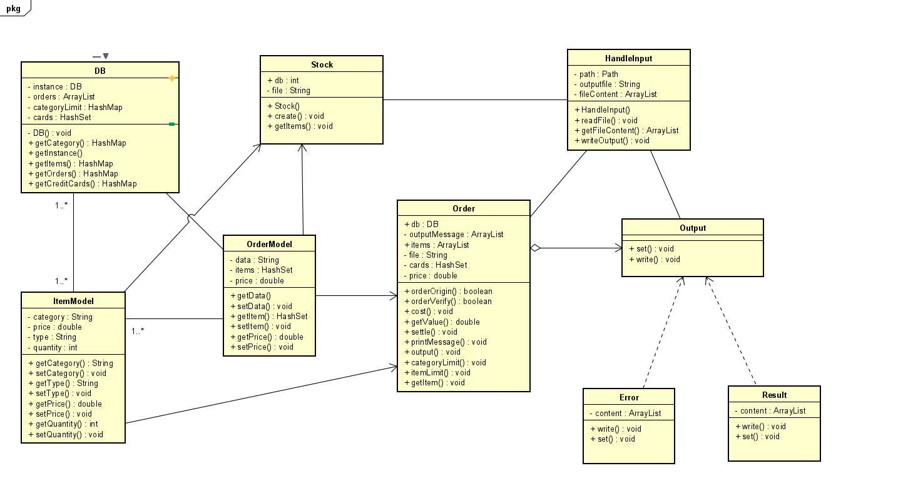
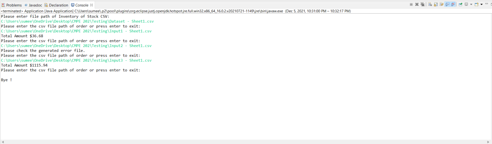
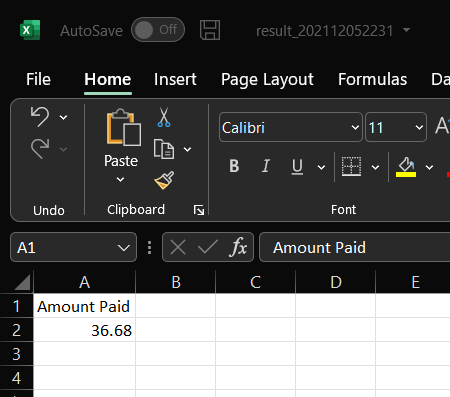
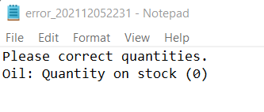
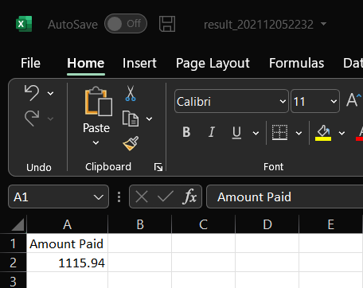

#Individual Assignment - Stock Inventory

Technologies- Java

How to run the project:
1. If Java is already installed in your system the fine or else install java in your system.
2. Clone the git repo.
3. Import the project in any IDE.
4. Open the Inventory/src/application package and run Application.java as Java Application
5. Input the dataset path to CSV file in console without any "" or / instead of \. (Example path: C:\CMPE 202\Testing\Dataset.csv)
6. Input the order path to CSV file in console without any "" or / instead of \. (Example path: C:\CMPE 202\Testing\Order.csv)
7. Errors can be seen in error log file(same folder as input file) or on console for any incorrect path input or file.
8. For correct transaction, output file will be generated(same folder as input file).

Design Pattern:
* Singleton Design pattern was followed to ensure that DB class has only one instance, while providing a global access point to this instance.
* Decorator Design pattern was followed on HandleInput class to use filepath independent from Order or Stock Class.
* Factory Method Design pattern was followed on Output interface as Error and Result used similar objects but the type of objects used were altered.

Class Diagram:

Output:

* Console Output-

* Output 1-

* Output 2-

* Output 3-

